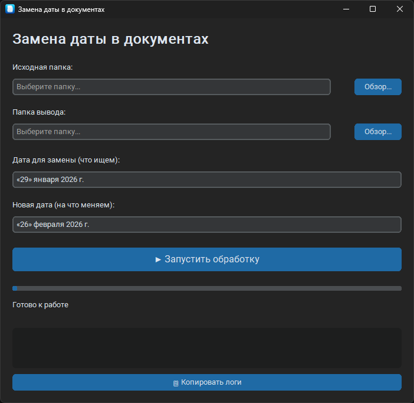

# Docx Date Replacer

Утилита для пакетной замены даты в документах `.docx`.




## Что делает

- Рекурсивно обходит папку с документами
- Находит указанную дату на первой странице каждого документа
- Заменяет её на новую дату, сохраняя исходное форматирование (шрифт, размер, стиль)
- Копирует все файлы в отдельную папку с сохранением структуры подпапок
- Оригинальные файлы **не изменяются**

## Как работает

Программа проверяет **первую страницу** каждого документа (первые ~50 строк текста и первые ~100 ячеек таблиц). Если на первой странице найдена указанная дата — она заменяется. Дата может находиться в любом месте первой страницы: в шапке, в блоке «УТВЕРЖДАЮ», в теле документа или в таблице.

Если дата не найдена — файл просто копируется в папку вывода без изменений.

## Системные требования

- **ОС:** Windows 10/11
- **Python:** 3.10+

## Быстрый старт

### Первый запуск

```bash
# Клонирование репозитория
git clone https://github.com/gogolevmatvey/docx-date-replacer.git
cd docx-date-replacer

# Создание и активация виртуального окружения
python -m venv .venv
.venv\Scripts\activate

# Установка зависимостей
pip install -e .

# Запуск
python -m src.main
```

### Последующие запуски

```bash
.venv\Scripts\activate
python -m src.main
```

## Сборка .exe

```bash
.venv\Scripts\activate
pyinstaller --clean --onefile --windowed --name "DocxDateReplacer" --icon=docx-date-replacer.ico --add-data "docx-date-replacer.ico;." src\main.py
```

Готовый файл: `dist\DocxDateReplacer.exe`

## Тесты

```bash
pytest tests/ -v
pytest tests/ --cov=src --cov-report=term-missing -v
```

## Как пользоваться

1. Нажмите **«Обзор...»** рядом с «Исходная папка» и выберите папку с документами
2. Выберите папку для сохранения результата
3. Укажите даты для замены
4. Нажмите **«Запустить обработку»**

Результат будет сохранён в выбранную папку с полной копией структуры подпапок.

---

## Лицензия

MIT
